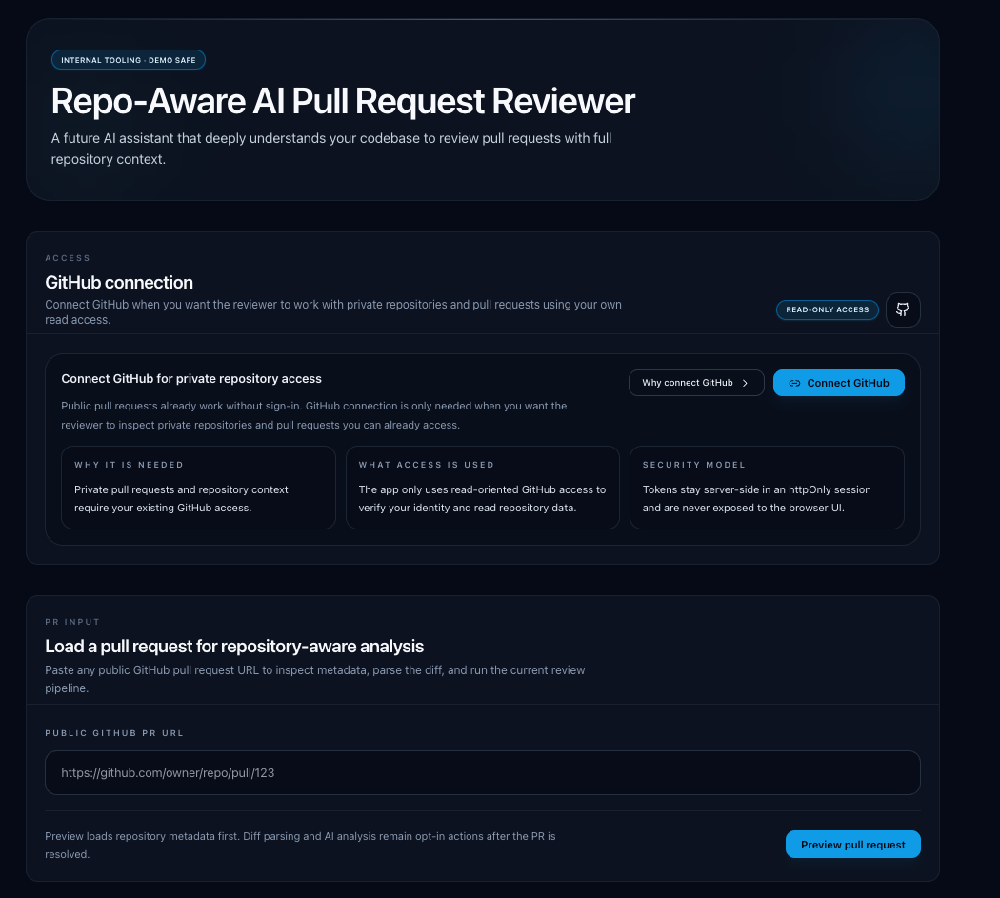
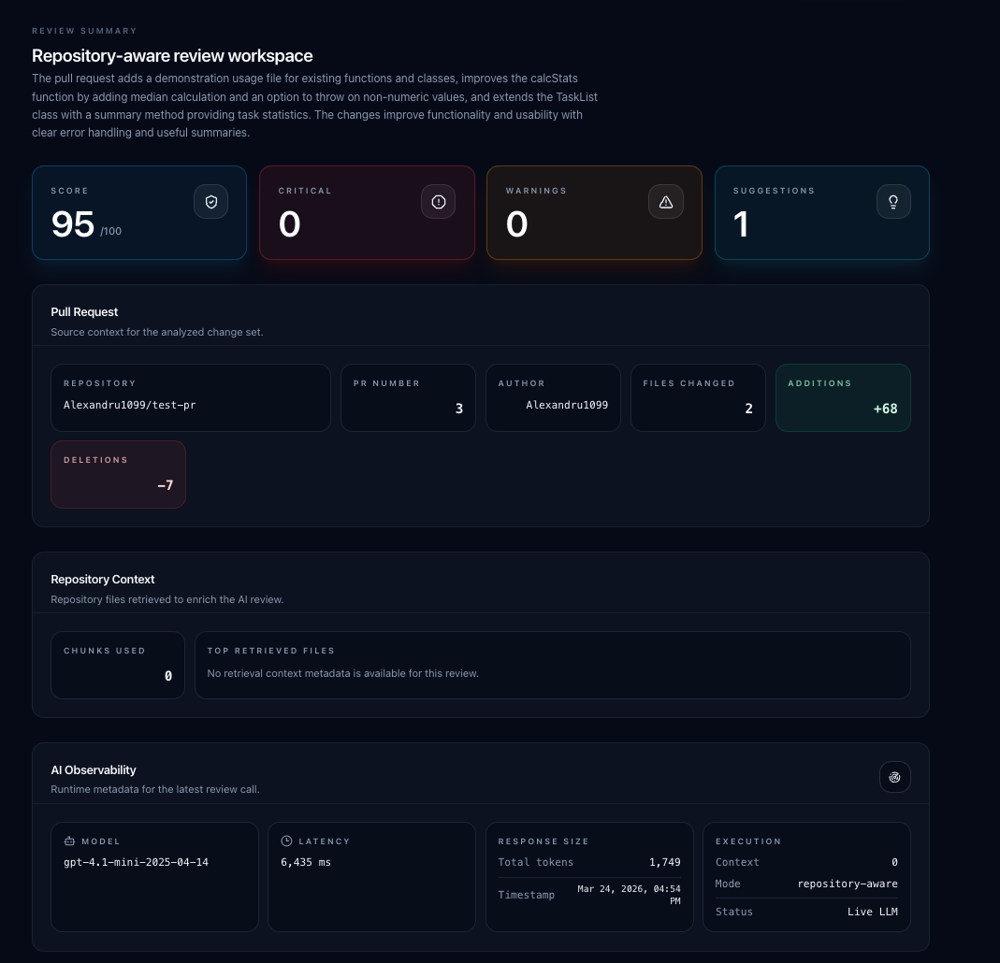
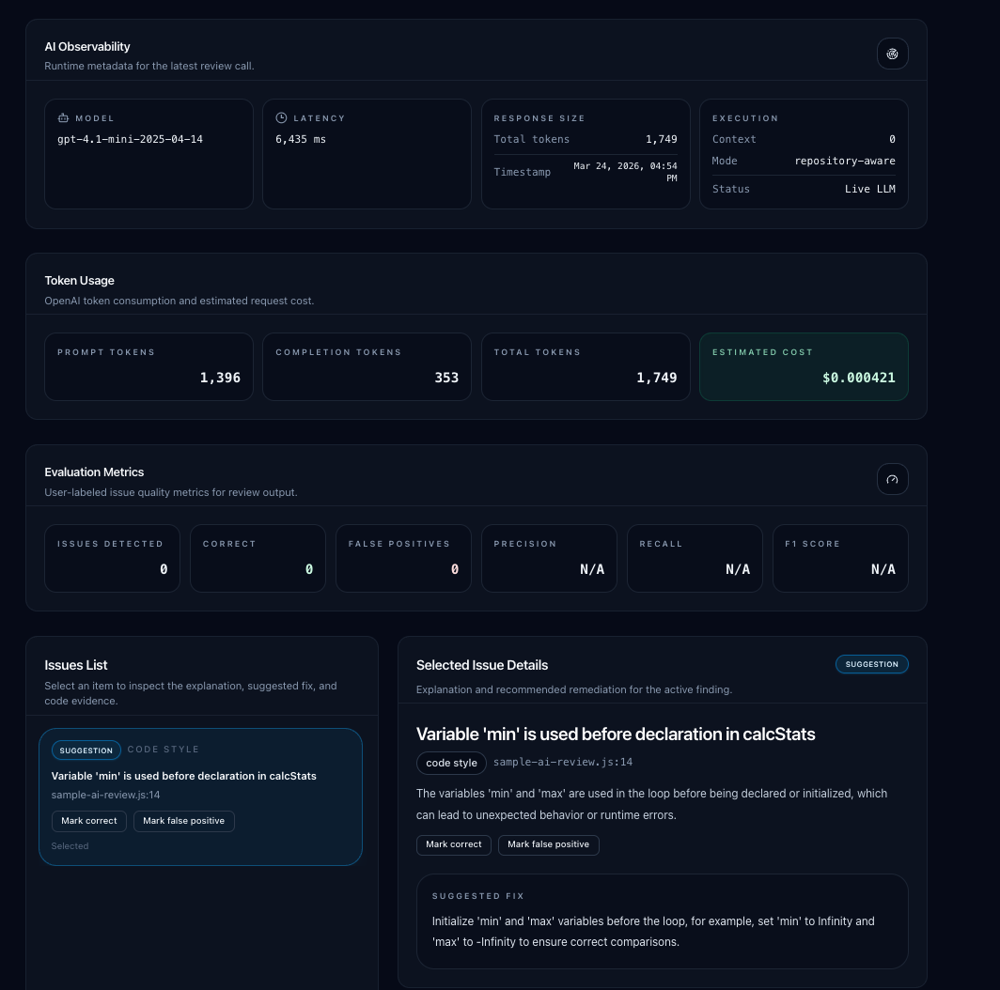

# Repo-Aware AI Pull Request Reviewer

> A full-stack AI system that reviews GitHub pull requests with **full repository context** — not just the diff.

Built with a RAG pipeline, structured LLM output, real-time observability, and GitHub OAuth. Designed for teams that want AI code review grounded in how the codebase actually works.

---

## Demo

### Landing & PR Input


### AI Review Dashboard


### AI Observability & Issue Detail


---

## How it works

Most AI PR reviewers see only the diff. This one retrieves relevant files from the repository, embeds them into a vector store, and feeds that context to the LLM alongside the diff — so the review is grounded in the actual codebase.

```
GitHub PR URL
     │
     ▼
┌─────────────────────────────────────────────┐
│  1. Fetch PR metadata + changed files       │  GitHub API
│  2. Chunk + embed repository files          │  sentence-transformers
│  3. Retrieve top-K relevant chunks          │  ChromaDB vector search
│  4. Build structured prompt                 │
│  5. LLM call → validated JSON output        │  OpenAI GPT-4.1-mini
│  6. Return issues, score, token usage       │
└─────────────────────────────────────────────┘
```

---

## Architecture

```
.
├── backend/                    # FastAPI
│   └── app/
│       ├── api/routes/         # /review/analyze, /review/pr-preview, /auth
│       ├── services/           # LLM orchestration, GitHub OAuth, session
│       ├── chunker.py          # File chunking strategy
│       ├── embeddings.py       # sentence-transformers embedding
│       ├── vector_store.py     # ChromaDB interface
│       ├── retriever.py        # RAG retrieval pipeline
│       ├── llm_review.py       # Structured prompt + OpenAI call + retry
│       ├── diff_parser.py      # Unified diff parser
│       └── repo_fetcher.py     # GitHub file tree fetcher
└── frontend/                   # Next.js 14 (App Router)
    └── src/
        ├── app/
        └── components/         # Review dashboard, PR form, GitHub auth panel
```

### Key design decisions

| Decision | Rationale |
|---|---|
| ChromaDB + sentence-transformers | Self-contained vector search, no external infra required |
| Pydantic-validated LLM output | Structured JSON with automatic retry on schema mismatch |
| `USE_MOCK_REVIEW` flag | Switch between heuristic and live LLM without redeploying |
| `@lru_cache` on settings | Single settings parse per process; hot-reload via restart |
| httpOnly session cookies | GitHub tokens stay server-side, never exposed to frontend |

---

## Stack

**Backend**
- Python 3.11 · FastAPI · Pydantic v2
- OpenAI SDK (GPT-4.1-mini, structured output)
- sentence-transformers (local embeddings)
- ChromaDB (in-process vector store)
- httpx (async GitHub API client)

**Frontend**
- Next.js 14 (App Router) · TypeScript · Tailwind CSS

**Infrastructure**
- Docker Compose · Makefile

---

## AI Observability

Every review exposes full runtime metadata:

- Model name and version
- Latency (ms)
- Prompt / completion / total tokens
- Estimated cost (USD)
- Chunks retrieved and top files used
- Review mode (`repository-aware` vs `mock-heuristic`)

User-labeled evaluation metrics (correct / false positive) are tracked per issue for future fine-tuning data collection.

---

## Setup

### Prerequisites

- Python 3.11+
- Node.js 20+ and Yarn
- Docker + Docker Compose

### Environment

```bash
cp .env.example .env
cp backend/.env.example backend/.env
cp frontend/.env.example frontend/.env
```

Set the following in `backend/.env`:

```env
OPENAI_API_KEY=sk-...
USE_MOCK_REVIEW=false

# Optional: GitHub OAuth for private repo access
GITHUB_CLIENT_ID=...
GITHUB_CLIENT_SECRET=...
GITHUB_OAUTH_REDIRECT_URI=http://localhost:8000/api/auth/github/callback
SESSION_SECRET=<random-string-32-chars-min>
```

### Run with Docker

```bash
make up
```

- Frontend: http://localhost:3000
- Backend: http://localhost:8000/health

### Run locally

```bash
# Backend
cd backend
python -m venv .venv && source .venv/bin/activate
pip install -r requirements.txt
uvicorn app.main:app --reload --port 8000

# Frontend (separate terminal)
cd frontend
yarn install && yarn dev
```

---

## API

| Method | Path | Description |
|---|---|---|
| `POST` | `/api/review/pr-preview` | Fetch PR metadata from GitHub |
| `POST` | `/api/review/analyze` | Run full RAG + LLM review |
| `GET` | `/api/auth/github/login` | Start GitHub OAuth flow |
| `GET` | `/api/auth/github/callback` | OAuth callback |
| `GET` | `/health` | Health check |

---

## GitHub OAuth

- OAuth App flow with signed `state` cookie (CSRF protection)
- Session cookies: `httpOnly`, `sameSite=lax`, `secure` in production
- Access tokens are never returned to the frontend
- Read-only scope: `read:user repo`
- In-memory session store (single-instance)
